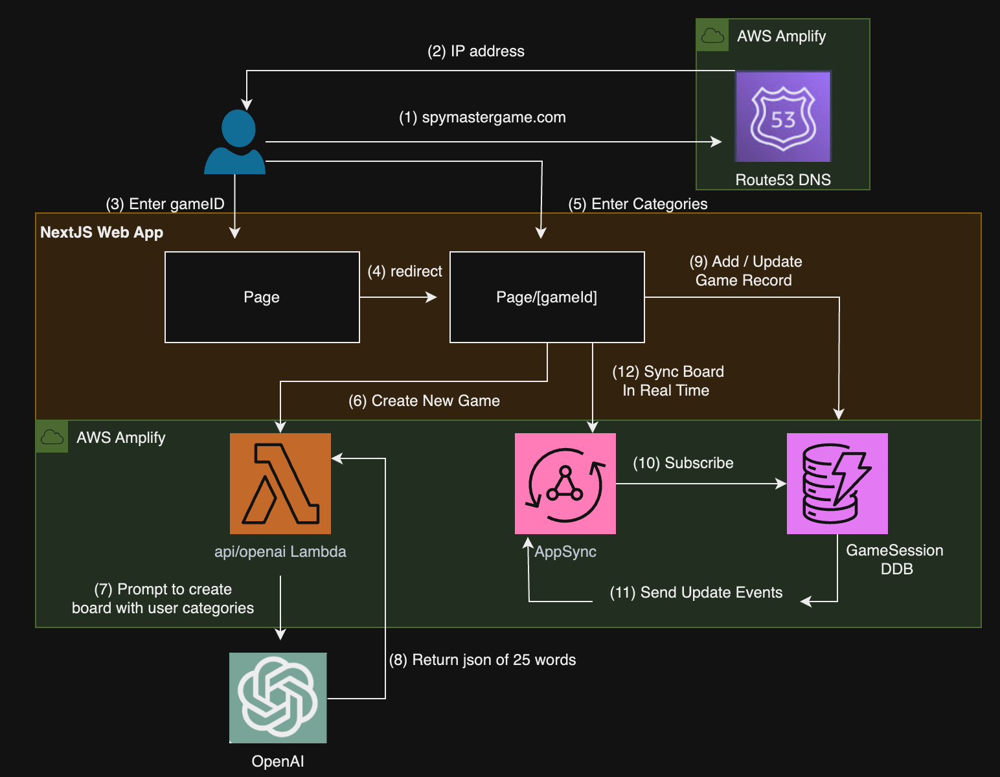

# Spymastergame AI

Spymastergame AI is an innovative web application that generates and displays customizable boards for the popular board game [Codenames](https://en.wikipedia.org/wiki/Codenames_(board_game)). Our unique approach sets us apart from other online Codenames apps by allowing users to input five categories, which are then used to construct the game board with relevant words.

## Key Features

- **Category-based Board Generation**: Users can enter 5 categories of their choice, making each game more engaging and personalized.
- **Shareable Boards**: Generated boards can be easily shared with other players.
- **Real-time Updates**: The board automatically updates as words are revealed during gameplay.
- **Dual View Modes**: Players can toggle between spymaster and regular player views.

## How It Works

1. Enter 5 categories of your choice
2. Our AI generates a Codenames board using words related to your categories
3. Share the board with your friends
4. Play as either a spymaster or a regular player
5. Enjoy a unique and engaging Codenames experience!

## Try It Out

A hosted version of Spymastergame AI is available at [spymastergame.com](https://spymastergame.com/).

Experience Codenames like never before with Spymastergame AI - where every game is tailored to your interests!

## System Architecture 

This NextJS application is deployed using AWS Amplify. AWS Amplify is a platform that helps developers quickly build and deploy full-stack web and mobile apps.

## Deploying to AWS

1. Clone / Fork this repo
2. Create OpenAI API key for this repo 
3. Using AWS Amplify create a new app and connect this repo to AWS Amplify 
4. In your environment variables add the variable "OPENAI_API_KEY" and the key created in Step 2
5. Deploy 

For detailed instructions on deploying this application, refer to the [deployment section](https://docs.amplify.aws/nextjs/start/quickstart/nextjs-app-router-client-components/#deploy-a-fullstack-app-to-aws) of AWS Amplify documentation.

## License

This library is licensed under the MIT-0 License. See the LICENSE file.
